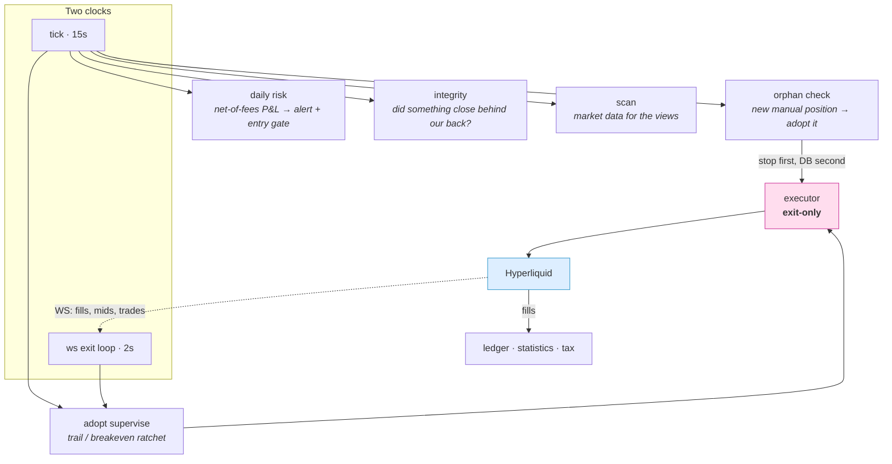

<h1 align="center">Helm</h1>

<p align="center">
  <em>I enter by hand. The bot babysits the exit and keeps the books.</em><br>
  A trading workbench for <a href="https://hyperliquid.xyz">Hyperliquid</a>.
</p>

<p align="center">
  
  
  
  
  
  
</p>

---

**There are no automatic entry strategies here.** Every one that used to live in this repo — carry,
fade, Hunter (short/long/+OI), Candy Girl, Fade-high-ER, Hot Movers, Swing — was measured against
real fills and deleted once the numbers said there was no edge. Twenty-five hypotheses are closed
and buried; thirty-three are pre-registered, forty-five runs are on the record, and most of them
came back negative.

What survived measurement is the boring half: a nanny that protects a position I opened myself, a
ledger that reconstructs the truth from on-chain fills, and read-only views that show data instead
of signals.

Read [FREEZE.md](FREEZE.md) before proposing a new strategy — it explains why that is usually the
wrong idea.

## What it does

**Adopt — the nanny.** Picks up a position opened by hand and immediately places a reduce-only stop
on the exchange plus a limit order at the target. It never opens anything. If the stop cannot be
placed, the position is *not* adopted and an urgent push says so: the bot refuses to pretend a
position is protected when it isn't.

**Ledger.** Monthly P&L rebuilt from `userFillsByTime`, split into bot / adopted / manual, with fees
and funding broken out. Click a month for a Mon–Sun calendar with weekly subtotals. Past months are
frozen snapshots; the current month recomputes live.

**Risk rails.** Daily stop-loss (net of fees, from fills), circuit breaker after consecutive losses,
notional cap, leverage cap, blacklist. They gate the trade ticket, not just the bot.

**Views.** Screen (coins ranked by friction, not by movement), OI history, Coin of the day, a
chart-reading journal, and a coach that breaks a chart down 4h → 1h → 5m. Every one is labelled as
analysis, never as a proven edge.

**Taxes.** PIT-38 summary in PLN, fed by the same fills as the ledger.

## Architecture



Two invariants the code is built around:

1. **The executor is exit-only.** `execute()` handles CLOSE; OPEN is refused with a warning. Entries
   come from a human pressing a button.
2. **Fills are the source of truth, never the local `positions` table.** The DB is a mirror, and
   mirrors drift — nine separate drift bugs are documented in the code that fixed them.

## Research protocol

The interesting part of this repo is not the bot, it is the machinery that keeps me from fooling
myself about it. At `alpha = 0.05`, one run in twenty looks beautiful by chance, and that one will
eat a month.

| Guard | What it prevents |
|---|---|
| Pre-registration before data (`tools/harness.mjs`) | Rewording the hypothesis after seeing the result |
| Append-only registry, empty runs included | "I think we tried about five" instead of a count |
| Mandatory surrogate baseline | Reading noise as signal |
| Second market regime required to confirm | Ten thousand points of one regime confirming nothing |
| Benjamini–Hochberg FDR across the whole registry | Multiplicity creeping in one run at a time |
| CI95 mandatory in every reported metric | A mean whose interval spans zero passing as a result |

The registry lives in `data/hypotheses/registry.json` and is committed on purpose: it is the record
of the research, not raw data. Costs are always reported in the same unit as the effect — an edge
smaller than the fees is a dead edge no matter how small the p-value.

## Quick start

```bash
npm install
cp .env.example .env      # set PUBLIC_WALLET_ADDRESS at minimum

npm test                  # 573 tests + 4 CI guards
npm run build:dash        # build the dashboard front-end
npm start                 # bot + dashboard on :3010
```

<details>
<summary><b>Docker, hot reload, and what runs in production</b></summary>

```bash
npm run dev:dash          # vite on :5173, proxies /api to :3010

docker compose up -d --build
docker compose logs -f --tail 100
```

Production is a single container on a small VPS. The dashboard sits behind a Cloudflare tunnel; a
second login layer switches on when `DASHBOARD_USER` and `DASHBOARD_PASS` are set. The container
starts as root only long enough for the entrypoint to fix bind-mount ownership, then drops to the
`node` user via `su-exec`.
</details>

<details>
<summary><b>Pages</b></summary>

| URL | What it is |
|-----|------------|
| `/` | Equity, active position, Screen, activity |
| `/ledger` | Monthly P&L + daily calendar + tax summary |
| `/statistics` | Lifetime cuts: per coin, per side, MFE/MAE, daily heatmap |
| `/oi` | Nanny panel, Coin of the day, OI history |
| `/journal` | Chart-reading drill: mark up a coin a day ahead, review it the next |
| `/lab` | Running forward tests and closed verdicts |
| `/orderbook`, `/orderbook-sim` | Live book, and a trainer for execution cost |

Old `/page.html` addresses answer with a 301 to the clean URL.
</details>

<details>
<summary><b>Configuration</b></summary>

Everything is environment variables; `.env.example` carries the full list with comments.

| Variable | Default | What it controls |
|----------|---------|------------------|
| `PUBLIC_WALLET_ADDRESS` | — | Required. The account the bot reads and trades. |
| `HL_AGENT_PRIVATE_KEY` | — | Agent wallet (recommended — it cannot withdraw). |
| `ADOPT_ENABLED` | `true` | The nanny. Off means manual positions stay unprotected. |
| `ADOPT_STOP_PCT` | `5` | Stop distance when ATR is unavailable. |
| `ADOPT_TP_RR` | `1` | Target as a multiple of risk. |
| `DAILY_LOSS_LIMIT_ENABLED` | `true` | Daily stop: blocks new entries until midnight. |
| `WALLET_LEVERAGE_CAP` | — | Hard cap above whatever the exchange allows. |
| `NTFY_*` | — | Push notifications; quiet hours are respected. |
</details>

<details>
<summary><b>Testing and the four guards</b></summary>

```bash
npm test        # node:test, no framework
npm run lint    # eslint
```

Before a single test runs, four guards sweep the codebase. Each one exists because a rule that lived
only in prose failed to hold:

| Guard | Fails when |
|---|---|
| `checkImports` | A relative import does not resolve. A dangling one once survived 378 green tests and would have killed the bot on start. |
| `checkGlyphs` | An icon is an emoji instead of `icon()`, or a tooltip bypasses `data-tip`. |
| `checkUiLanguage` | Russian text reaches a surface the browser can render. |
| `checkComments` | A comment carries a date, a commit hash, or a changelog of how the code got written. Debt is ratcheted per file, so it can only go down. |
</details>

## A note on language

The interface, the documentation and this README are in English. Code comments, log lines and the
operator's push alerts are in Russian: they are the author's working notes, written to be read at
3am, and translating them would cost their precision. `checkUiLanguage` keeps the split honest.

## Disclaimer

This software places real orders with real money on a live exchange, using a private key you supply.
It is published as a record of an engineering process — not a product, not a strategy, not a
recommendation. There is no edge here to copy: the strategies were measured and removed.

- No warranty of any kind. You run it at your own risk and you own every loss it produces.
- Nothing here is financial advice. The author is not a licensed advisor.
- Use an **agent wallet** (`HL_AGENT_PRIVATE_KEY`) — it cannot withdraw funds. Never put a
  withdrawal-capable key in `.env`.
- The defaults are tuned for a small deposit run by one person. They are not safe defaults for size.

## What this project is not

It is not a source of income and it is not looking for a strategy. Fees were 100% of the historical
loss; the answer was fewer and larger trades by hand, with the bot doing the part I am bad at —
holding a stop and not touching the position. Any number that could support a claim of edge gets a
forward test with a pre-registered decision date, and most of them close negative.

That is the point, not a disappointment.

## License

[Apache-2.0](LICENSE). Copyright 2026 Michael Vlasov.
